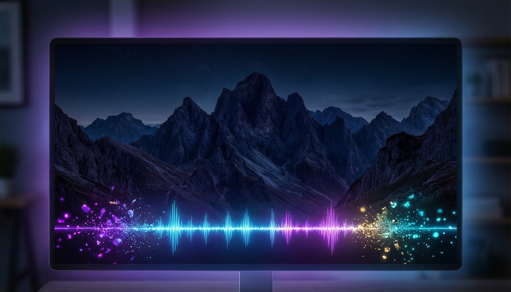
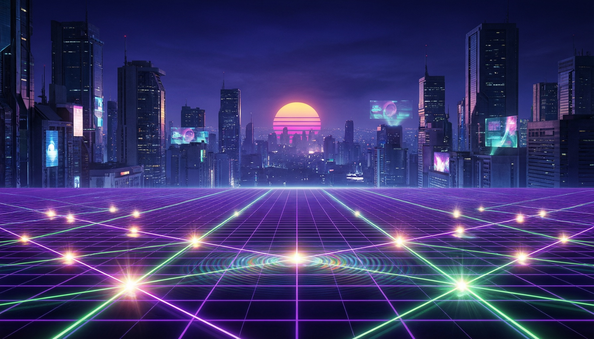

# 🎵 Beat Wallpaper — 音乐律动壁纸

让桌面壁纸跟随系统音乐「活」起来的跨平台桌面应用（macOS / Windows）。

静态壁纸不再静止——音波随音乐跳动、粒子随节拍分裂、光晕随低频呼吸，每个主题都有专属的招牌动态效果。



## ✨ 特性

- **系统音频捕获**：macOS 使用 ScreenCaptureKit 直接捕获系统输出音频（无需麦克风权限），Windows 使用 WASAPI loopback
- **实时频谱分析**：mel 频率映射 + 对数压缩 + 非对称时间平滑，音波平滑且真实
- **主题专属效果**：
  - 🌀 **极光** — 顶部流动极光幕帘，随中频波动
  - ⚡ **霓虹** — 旋转透视赛博网格，beat 脉冲发光
  - 🌊 **深海** — 海浪随低音涌动 + 音乐驱动的上升气泡
  - 🔥 **烈焰** — 火焰升腾摇曳 + 火光闪烁
  - ❄ **纯净** — 雪花飘落
  - ❤ **心跳** — 红色爱心上浮
  - 🎵 **律动** — 经典音波条 + 壁纸缩放
  - ✨ **幻境** — 全家桶派对模式
  - 👾 **8-bit** — 像素化爆炸重组
- **氛围层**：背景光晕、节拍闪光、电影暗角、主题色调滤镜（低强度不盖壁纸）
- **粒子游戏**：碰音波分裂（70% 1生2 / 30% 1生3）、边界消失、保底 1 个
- **多显示器**：每个显示器独立壁纸窗口，主题同步切换
- **常驻后台**：托盘运行、轻量化（30fps 分析 + 预分配渲染资源）

## 🖼 主题预览

| 极光 | 霓虹 |
|------|------|
|  |  |

| 深海 | 烈焰 |
|------|------|
|  |  |

## 🛠 技术栈

- **Tauri v2**（Rust 后端 + WebView 前端）
- **React 18 + TypeScript + Vite**
- **Three.js**（WebGL 渲染：音波条、粒子、光晕、招牌效果）
- **rustfft**（FFT 频谱分析）
- **ScreenCaptureKit / WASAPI**（跨平台系统音频捕获）

## 🚀 开发运行

```bash
npm install
npm run tauri dev
```

首次运行会引导选择主题；之后常驻系统托盘，点击托盘图标或 Dock 图标可打开设置窗口。设置变更需点击「确认更改」统一生效。

## 📁 结构概览

```
src/
  effects/          # Three.js 效果（音波条/粒子/氛围层/招牌效果/8bit）
  components/       # 设置面板 / 壁纸画布 / 引导页
  themes.ts         # 9 个主题的配色与参数
src-tauri/
  src/audio/        # 音频捕获 + FFT 分析 + 节拍检测
  src/wallpaper/    # 壁纸窗口（桌面层级嵌入）
```

## ⚠️ 说明

- macOS 上壁纸渲染在系统桌面层（`CGWindowLevelForKey(desktop)`），独立于系统自带壁纸
- 演示图片为效果概念渲染图，实际效果以运行应用为准

## 📥 下载

**v0.1.0（macOS ARM64）**

[⬇ BeatWallpaper_0.1.0_aarch64.dmg](https://github.com/Monster3456/beat-wallpaper/releases/download/v0.1.0/BeatWallpaper_0.1.0_aarch64.dmg)

> 首次打开 `.app` 若提示"未识别的开发者"，前往 **系统设置 → 隐私与安全性**，点击"仍要打开"即可。
>
> **Windows 版本说明**：Windows 壁纸嵌入层尚未完善（`setup_wallpaper_window` 为存根），应用可以运行但窗口不会嵌入桌面图标下方。Windows 打包需 Windows 开发环境，欢迎 PR 或在 Issues 中反馈需求。
